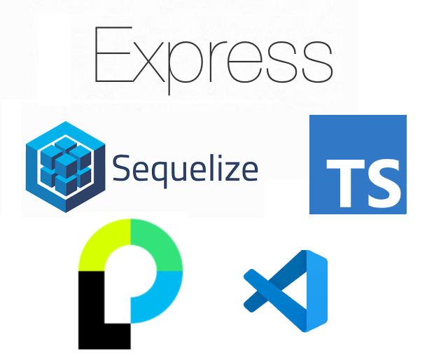

<h1 align="center">Express Typescript Sequelize Starter</h1>

<p align="center">
  
</p>

<p align="center">
  A typescript boilerplate for NodeJS express applications!
  <br>
  <sub>Made with ❤️ by <a href="https://github.com/akcyp">akcyp</a>
</p>

# Stack

- Express.js
- Sequelize (ORM)
- Ejs (template engine)
- Passport (auth)

And more:

- Express-session
- Express-validator
- Cors
- Dotenv-flow
- Connect-flash
- Bcrypt
- Express-awesome-router

# Pre-reqs

- Install NodeJS
- Install VSCode
- Install Xampp

# Getting started

- Clone the repository

```bash
git clone --depth=1 https://github.com/akcyp/express-sequelize-typescript-starter.git <project_name>
```

- Install dependencies

```bash
cd <project_name>
npm install
```

- Create `example_db` database (xampp, phpmyadmin recommended)

- Start the application

```bash
npm run start
```
